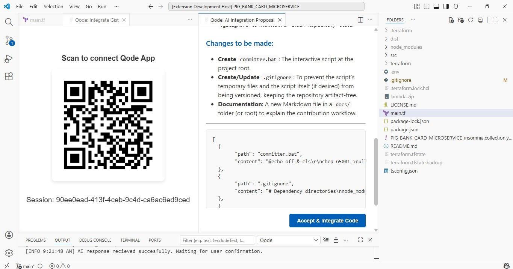

# Qode: VS Code AI & Gist Integrator 🚀


## 🎯 Overview

**Qode Extension** is the desktop counterpart of the Qode ecosystem. It allows developers to instantly sync GitHub Gists from their mobile device to their workspace using a secure QR-based handshake. Built with **Clean Architecture** and **Dependency Injection**, it ensures a robust and scalable environment for AI-assisted coding.

## ✨ Key Features

### 🔐 Persistent QR Handshake
- **Project-Specific Identity**: Generates a unique UUID that persists per project and machine using `workspaceState`, ensuring consistent sessions even after restarting VS Code.
- **Instant Pairing**: Renders a high-resolution QR code directly in a Webview panel for seamless mobile scanning.

### 🔥 Real-time Firebase Sync
- **Firestore Integration**: Leverages a Singleton Firebase service to listen for incoming Gist data in real-time.
- **Reactive UI**: Automatically detects when a Gist is sent from the mobile app and notifies the user to begin the AI analysis.

### 🏗️ Enterprise-Grade Architecture
- **InversifyJS (IoC)**: Pure Dependency Injection container management for decoupled services.
- **Clean Layers**: Strict separation between `Core` (Business Logic), `Infra` (External Services/API), and `IoC` (Configuration).

## 🏗️ Project Structure

The extension follows a Clean Hexagonal Layers approach:

```text
src/
├── core/
│   └── entities/            # Domain models (QodeSession)
├── infra/
│   ├── services/            # Firebase and Session implementations
│   └── providers/           # UI Providers (QR Webview)
├── IoC/
│   ├── container.ts         # InversifyJS container setup
│   └── types.ts             # Symbol identifiers for Injection
├── extension.ts             # VS Code extension init
└── main.ts                  # Bootstrap & Environment configuration
```

## 🚀 Getting Started

# Prerequisites

<ul>

<li><strong>Node.js</strong> 18+</li>
<li><strong>VS Code</strong> v1.80.0+</li>
<li><strong>Firebase</strong> A Firebase Project with Firestore enabled.</li>

</ul>

# 🛠️ Installation & Setup

<ol>

<li>

<strong>Clone the repository</strong>

```bash

git clone [https://github.com/MaySalguedo/qode-vscode-extension.git](https://github.com/MaySalguedo/qode-vscode-extension.git)
cd qode-vscode-extension
npm install

```

</li>

<strong>Compile & Run</strong>

```bash

npm run bundle

```

<ul>

<li>Press F5 in VS Code to launch the Extension Development Host.</li>

<li>Run the command `Qode: Connect Mobile App` from the Command Palette (`Ctrl+Shift+P`).</li>

</ul>

</li>

</ol>

## 🛠️ Tech Stack

<ol>

<li><strong>Bundler: </strong>esbuild for ultra-fast extension packaging.</li>
<li><strong>DI Container: </strong>InversifyJS for robust architecture.</li>
<li><strong>Database: </strong>Firebase Firestore for real-time synchronization.</li>
<li><strong>QR Engine: </strong>`qrcode` for dynamic image generation.</li>

</ol>

### Environment Configuration

Create a `.env` file in the root directory:

```bash
# Firebase credential
FIREBASE_API_KEY=YOUR_FIREBASE_API_KEY
FIREBASE_AUTH_DOMAIN=YOUR_FIREBASE_AUTH_DOMAIN
FIREBASE_PROJECT_ID=YOUR_FIREBASE_PROJECT_ID
FIREBASE_STORAGE_BUCKET=YOUR_FIREBASE_STORAGE_BUCKET
FIREBASE_MESSAGING_SENDER_ID=YOUR_FIREBASE_MESSAGING_SENDER_ID
FIREBASE_APP_ID=YOUR_FIREBASE_APP_ID

# Gemini credential
GEMINI_API_KEY=YOUR_GEMINI_APY_KEY
GEMINI_TEXT_MODEL_AI=YOUR_GEMINI_TEXT_MODEL_AI
```

## 📱 App Screenshots

<div align="center">
  <table>
    <tr>
      <td align="center"><b>Qode VSCode Extension</b></td>
    </tr>
    <tr>
      <td>
        
      </td>
    </tr>
  </table>
</div>